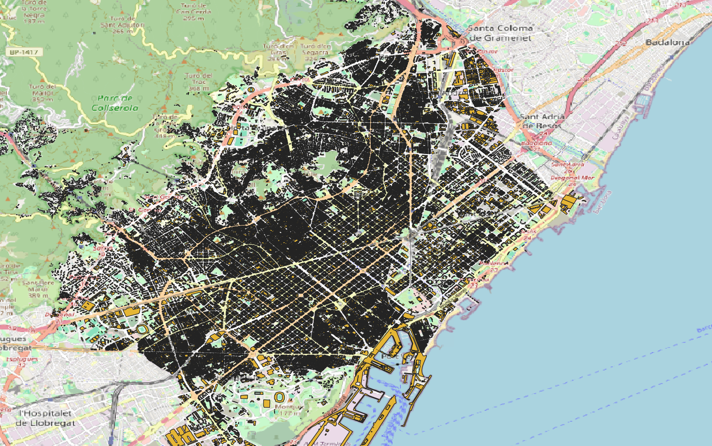

# Climate Ready Barcelona: Data ingestion and harmonisation to BIGG Ontology

This repository documents the data ingestion and harmonisation processes used in the Climate Ready Barcelona project. All datasets have been standardised and aligned with the BIGG Ontology, ensuring semantic interoperability and facilitating advanced queries, analysis, and integration across spatial and temporal dimensions.

The following links provide detailed information about the import tools and pre-processing workflows for each data source used in the project:

## Data sources

The following links will provide information of each data source import tool:

1. [Yearly gas and electricity consumption at census tract level from the Energy Agency of Barcelona](sources/AEB_consumption/README.md)
2. [Yearly gas and electricity consumption at building level from Metropolitan Area of Barcelona](sources/AMB_consumptions/README.md)
3. [Hourly electricity consumption at postal code level](sources/Datadis/README.md)
4. [Monthly electricity consumption at building level from ENDESA](sources/Endesa/README.md)
5. [Gas consumption at building level from NEDGIA](sources/Nedgia/README.md)
6. [Administrative layer: census tracts](sources/CensusTracts/README.md)
7. [Administrative layer: districts](sources/Districts/README.md)
8. [Administrative layer: postal codes](sources/PostalCodes/README.md)
9. [Administrative layer: neighbourhoods](sources/Neighbourhoods/README.md)
10. [Administrative layer: municipalities](sources/Municipalities/README.md)
11. [Digital Elevation Model](sources/EMG/README.md)
12. [Turistic establishments in Catalonia](sources/HUTS/README.md)
13. [Cadaster harmonised to INSPIRE](sources/Inspire/README.md)
14. [Normalized Difference Vegetation Index](sources/NDVI/README.md)
15. [Heating and cooling degree days from URBCLIM](sources/UrbClim/README.md)
16. [Hourly air temperature and relative humidity from URBCLIM](sources/Weather/README.md)

#### To setup a database, follow [this steps](setup.md)

## Authors
- Jose Manuel Broto - jmbroto@cimne.upc.edu
- Gerard Mor - gmor@cimne.upc.edu
- Eloi Gabaldón - egabaldon@cimne.upc.edu
  
Copyright (c) 2024 Jose Manuel Broto, Gerard Mor, Eloi Gabaldón
